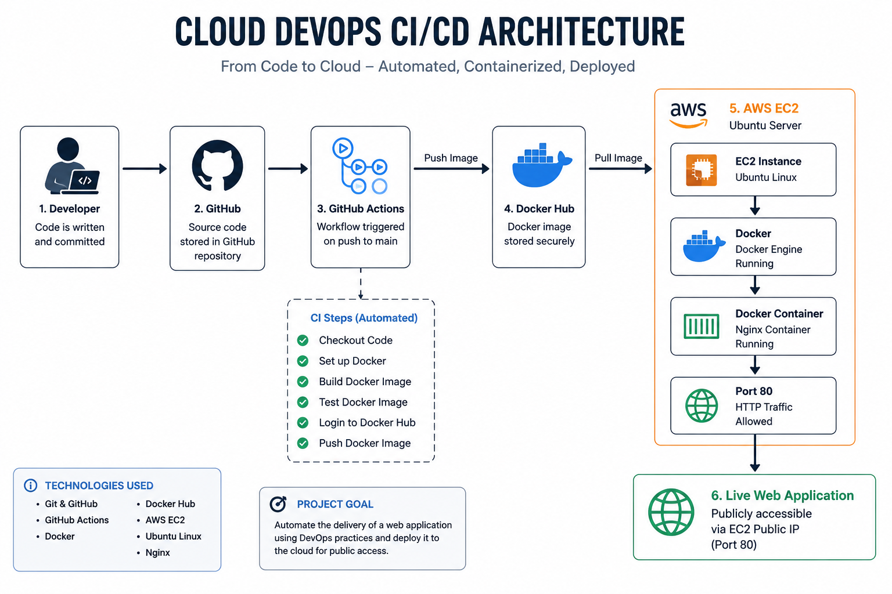

# 🚀 Cloud DevOps CI/CD Project

A hands-on Cloud DevOps project demonstrating how a containerized web application moves from source code to a publicly accessible deployment on AWS EC2.

The project combines Git, GitHub, Docker, GitHub Actions, Docker Hub, Linux, and AWS EC2 to demonstrate practical DevOps and cloud deployment concepts.

---

## 🏗️ Architecture



### End-to-End Flow

**GitHub → GitHub Actions → Docker → Docker Hub → AWS EC2 → Docker Container → Live Web Application**

---

## 🎯 Project Objective

The goal of this project is to gain practical experience with a real-world DevOps workflow:

- Manage source code using Git and GitHub
- Containerize a web application using Docker
- Automate Docker build and testing using GitHub Actions
- Publish Docker images to Docker Hub
- Deploy the containerized application on AWS EC2
- Configure basic cloud networking and security
- Expose the application through a public HTTP endpoint

---

## 🛠️ Technologies Used

| Technology | Purpose |
|---|---|
| Git | Version control |
| GitHub | Source code repository |
| GitHub Actions | CI automation |
| Docker | Application containerization |
| Docker Hub | Container image registry |
| Nginx | Web server |
| Ubuntu Linux | EC2 server operating system |
| AWS EC2 | Cloud compute infrastructure |
| AWS Security Groups | Network access control |
| SSH | Secure server administration |

---

## 🔄 CI Workflow

The GitHub Actions pipeline is triggered when changes are pushed to the `main` branch.

### Pipeline

```text
Developer
    │
    ▼
GitHub Repository
    │
    ▼
GitHub Actions
    │
    ├── Checkout Repository
    │
    ├── Build Docker Image
    │
    ├── Run Docker Container Test
    │
    ├── Login to Docker Hub
    │
    └── Push Docker Image
             │
             ▼
        Docker Hub
